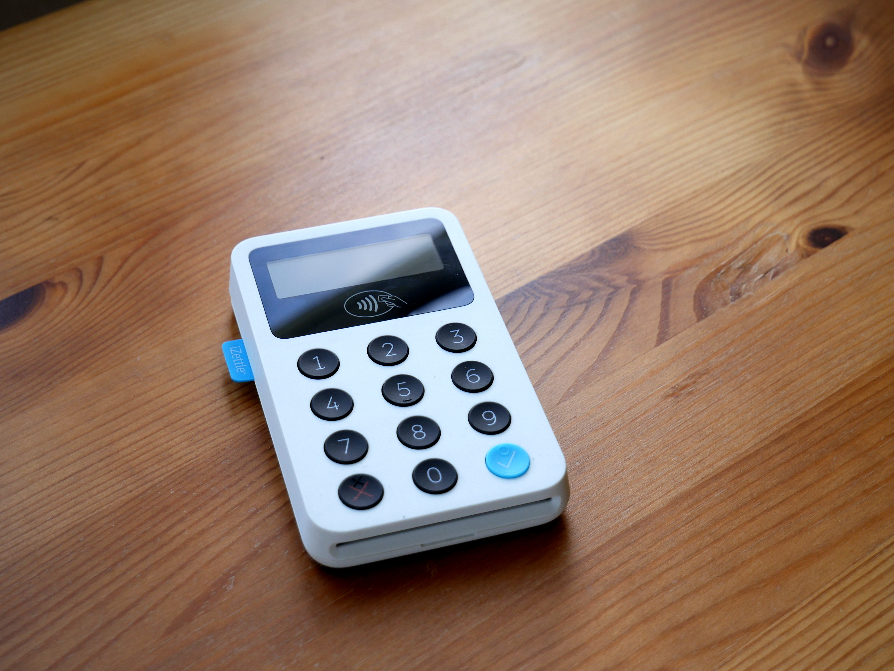
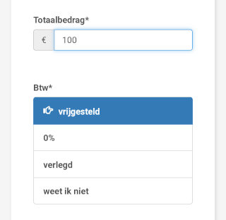
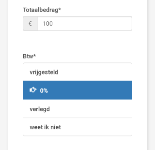
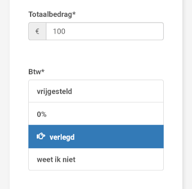
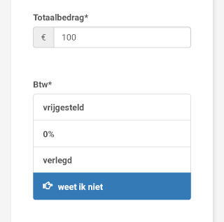

## En waarom krijg ik geen factuur van ze?

Een iZettle pinapparaatje is supergoedkoop. Zeker vergeleken met een pinapparaat van een bank. Dat is niet alleen maar omdat het ook een veel kleiner apparaatje is. Bij iedere transactie rekent iZettle namelijk een paar procent per transactie. Het percentage bepalen zij op basis van hoeveel transacties je per jaar via hen doet. (Je betaalt hen dus afhankelijk van hoeveel je iZettle gebruikt.) In je iZettle account zie je hoeveel toeslag je hen moet betalen.

Maar... daar staat geen btw bij. En je krijgt geen factuur waar de btw op staat. Hoe voer je dit dan in jodiBooks in? En dan vooral:

- Hoeveel btw zit/zat er dan op?
- Moet ik zelf met mijn rekenmachine aan de gang?
- En is het dan **vermenigvuldigen** met 1,21 of **delen** door 1,21?

Kortom: hoe zit het nou?

## Btw vrijgestelde dienst

Je kunt het wel op de website van iZettle vinden, maar je moet weten waar je naar op zoek bent. In hun algemene voorwaarden (d.d. 15–12–2018) staat het volgende

> De Betaaldienst is een betaaldienst die is vrijgesteld van btw.

Kortom, vrijgesteld. Er zit **geen btw** op. En er hoeft achteraf ook geen btw overheen. Daarom vind je de btw ook nergens terug in je iZettle dashboard.

### Dus ook geen factuur

Dat verklaart ook meteen waarom je geen factuur van ze krijgt: Dat **hoeven** ze niet volgens de belastingregels. Op de website van de belastingdienst kun je het volgende vinden (nouja… het is even zoeken misschien)

> De volgende ondernemers hoeven geen facturen te maken die aan alle eisen voldoen:
> - ondernemers die [vrijgestelde goederen of diensten](https://www.belastingdienst.nl/wps/wcm/connect/bldcontentnl/belastingdienst/zakelijk/btw/administratie_bijhouden/wie_moeten_een_btw_administratie_bijhouden/vrijgestelde_goederen_of_diensten_leveren) leveren

En wat betekent dat dan, "niet aan alle eisen" hoeven te voldoen? Nou, in dit geval, ook weer via de website van de belastingdienst:

> Levert u alleen goederen of diensten die zijn vrijgesteld van btw?
> - U bent niet verplicht facturen uit te schrijven.

Dus, iZettle hoeft, omdat hun dienst is vrijgesteld van btw, geen facturen uit te schrijven. En dat doen ze dus ook niet.

### Wat moet je in jodiBooks invullen?

Je zou misschien denken dat je deze uitgaven dan helemaal niet in [jodiBooks](https://www.jodibooks.com/) hoeft te zetten. Maar dat is niet waar. Dit zijn namelijk wel kosten die je met je bedrijf hebt gemaakt. Als je boekhouder die uitgaven niet meerekent in je aangifte, dan betaal je misschien wel meer belasting dan nodig is…

Dus, je doet het volgende.

1. Kies bij "[soort factuur](https://docs.jodibooks.com/docs/dashboard/uitgaven#stappenplan)" de optie "zonder btw"

2. Ga door naar de volgende stap, vul het bedrag in en kies "vrijgesteld"

* * *

## Drie smaakjes facturen zonder btw

Ook al is de iZettle vraag beantwoord, toch vertel ik nog even verder.

Iemand die jou een factuur stuurt, is verplicht te vermelden of er btw op zit. En zo ja, hoeveel.

Als er _geen_ btw berekend is door de verkoper, dan kan dat om **drie** redenen zijn.

### Vrijgesteld

De eerste optie is wat bij iZettle geldt: Het product of de dienst is vrijgesteld van btw. Er is geen btw berekend en dat hoeft ook niet. In dit geval heb je misschien geen factuur gehad.

Krijg je _wel_ een factuur, dan moet daar expliciet op vermeld staan dat er een btw vrijstelling geldt.

### Het speciale 0% tarief geldt

Dit is de tweede optie. Je moet een factuur hebben gekregen waar _expliciet_ op vermeld staat dat het 0% tarief van toepassing is. Met andere woorden: er is 0% btw berekend. Dus je betaalt btw over deze factuur. Het is alleen toevallig nul euro. 😂

(Dit is een speciaal tarief binnen Nederland, andere landen kennen dit tarief niet.)

Je vult het zo in.

1. Kies ook hier "zonder btw".

2. Ga door naar de volgende stap, vul het bedrag in en kies "0%"

### De btw is verlegd

De derde optie is verlegde btw. Als je via Facebook of Google reclame maakt, krijg je een factuur met btw verlegd bijvoorbeeld. De verkoper zit in dat geval in het _buitenland_ en zegt daarmee "Ik weet niet hoeveel btw in jouw land geldt en ik ga 't niet voor jou innen en afdragen. Je moet het zelf doen.". Je moet een factuur hebben gekregen waar dit _expliciet_op staat.

Je vult het zo in.

1. Kies opnieuw "zonder btw"
2. Ga door naar de volgende stap, vul het bedrag in en kies "verlegd". (Als het bedrag op de factuur niet in euro's is, vul dan het bedrag in wat van je bankrekening is afgeschreven.)

**Voetnoot**: verkopers uit het buitenland gebruiken soms onduidelijke bewoordingen voor de term "btw verlegd". De Engelse term is "Reverse charge". Dat kan soms knullig vertaald zijn naar "Kosten terugboeken".

Een andere veelgemaakte vergissing is dat buitenlandse leveranciers "btw 0%" op de factuur zetten. Dit is **niet** het speciale Nederlandse 0% tarief! (Zij weten niet eens dat dat bestaat…!)

**Tip**: Bij buitenlandse facturen, kun je er donder op zeggen dat de btw verlegd is!

### Twijfels over een factuur?

Staat het er niet duidelijk op? Kun je de informatie niet vinden? Kies dan in jodiBooks voor "weet ik niet". Wij markeren de uitgave zodat je boekhouder snel ziet dat er iets aan de hand is en het juist kan verwerken.

Of mail ons, ik zoek graag met je mee. Leren wij ook een hoop van ☺

* * *

### Nog even over die rekenmachine

De derde optie, verlegde btw, is bijzonder: er moet btw worden afgedragen maar er is door de verkoper (Facebook bijvoorbeeld) niet berekend hoeveel dan. Dat moet de koper doen. Jij dus.

Misschien had je bij het invoeren van een factuur in jodiBooks de gedachte "**Nu** moet ik mijn rekenmachine erbij pakken om zelf de btw uit te rekenen. Toch??".

In jodiBooks niet.

Huh wat?

Hoe bedoel je "in jodiBooks niet?".

Belastingregels zijn belastingregels, vertel me nou gewoon hoe het zit! 😤

Het zit zo: Met jodiBooks zijn we geen vervanger voor een boekhouder. Daar zijn al genoeg pakketten voor (Met leuzen als "Je hebt geen boekhouder meer nodig!").

Weet je waarom je met zo'n pakket geen boekhouder meer nodig hebt? Omdat je dan zelf **alle** belastingregels moet kennen ;)

Wij houden jodiBooks simpel voor jou. Je boekhouder weet wat hij met een verlegde factuur moet doen. En ook een keer "weet ik niet" aanklikken is niet erg. Misschien is je boekhouder daar juist blij mee, zo ziet hij snel waar hij nog wat moet uitzoeken.

Don't worry 🍹🌞

* * *

### Verlegde btw in je aangifte verwerken

Doe je je aangifte zelf of wil je precies weten hoe het zit? Voor de volledigheid schrijf ik hier op hoe je **verlegde** btw moet verwerken in je aangifte.

1. Reken het btw bedrag uit. Dat is 21% van het bedrag. Dus bij een bedrag van 100 euro is het 100\*0,21=21
2. Het bedrag wat hieruit komt vul je bij je btw-aangifte in bij rubriek 4b (leveringen en diensten waarbij de btw naar u verlegd is)
3. Hetzelfde bedrag voeg je toe aan rubriek 5b (vooraftrek).

Ja, onder de streep is dat nul. Je betaalt btw en je vraagt het ook weer terug. Net als bij een gewone factuur.
